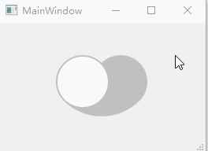

爱心开关
===

# 介绍

爱心形状的switch开关，支持手势拖动、按压效果


## 截图





## 使用

1. `lovely_heart_switch`文件夹加入工程，`.pro`文件中`INCLUDEPATH+=lovely_heart_switch`

2. ```C++
   LovelyHeartSwitch* swtch = new LovelyHeartSwitch(this);
   swtch->setState(bool);
   connect(swtch, SIGNAL(stateChanged(bool)), ...);
   ```


> 设计灵感：https://dribbble.com/shots/9070657-Heart-Switch